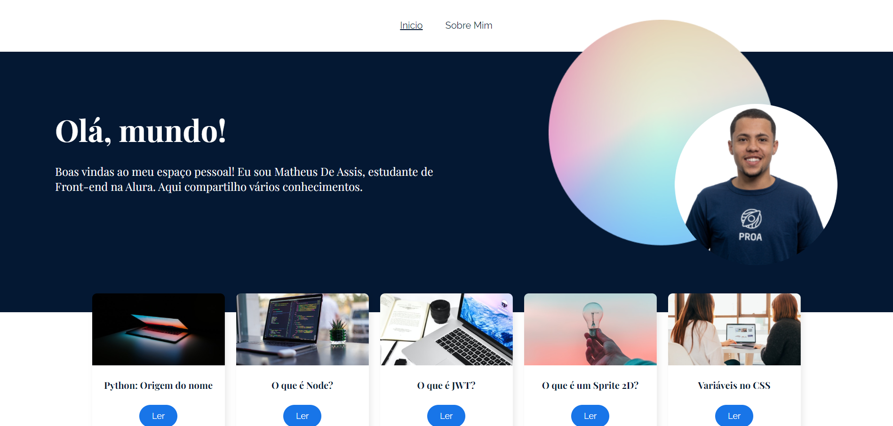

<h1> Olá Mundo! </h1>

 O projeto tem como objetivo apresentar minha trajetória profissional e acadêmica, oferecendo uma visão mais detalhada sobre meus estudos e minha carreira. É uma oportunidade para você conhecer melhor minha evolução e os interesses que guiam meu desenvolvimento profissional.

Foi desenvolvido com a biblioteca react-router-dom, aproveitando seus principais recursos, como rotas aninhadas e dinâmicas. Utilizou-se também hooks como useLocation, useParams, useNavigate e Outlet, além de componentes como Link. Além disso, o projeto faz uso de funções JavaScript como map, find, sort, filter e slice para manipulação e organização de dados.

## :dizzy: Tecnologias utilizadas

  
  
  
  

## :computer: Visão Geral do Projeto

### Interface do Usuário

## :hammer: Caracteristicas

- `Página Inicial:` Exibição de Galáxias: Apresenta uma coleção de imagens de galáxias. 

- `Sobre Mim:` Habilita a visualização ampliada das imagens em um modal, utilizando recursos do JavaScript.

- `Página de Post:` Oferece aos usuários Post's sobre tecnologias e assuntos educacionais.

## :mag: Demonstração

Para uma experiência completa e visual do projeto em funcionamento, você pode acessar a demonstração interativa do projeto, [clique aqui.](https://space-app-red.vercel.app/)

## :open_file_folder: Como Utilizar

1. Clone o repositório em seu ambiente de desenvolvimento.
2. Abra o arquivo index.html em seu navegador preferido.

## :student: Autor

Este repositório contém o projeto SpaceApp, desenvolvido no curso proporcionado pela Oracle em parceria com a Alura.
